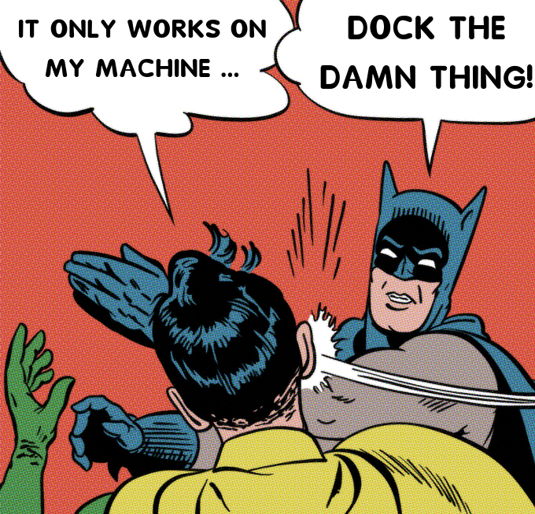

## What is Docker?

In case of software development industry most of the times developers and testers face situation like, a code that works in developers system properly but the same code does not working in the testing environment. There docker comes into the picture.

Docker is a platform designed to help developers build, share, and run modern applications. Docker handle all these tedious setup, so others can focus on the code.